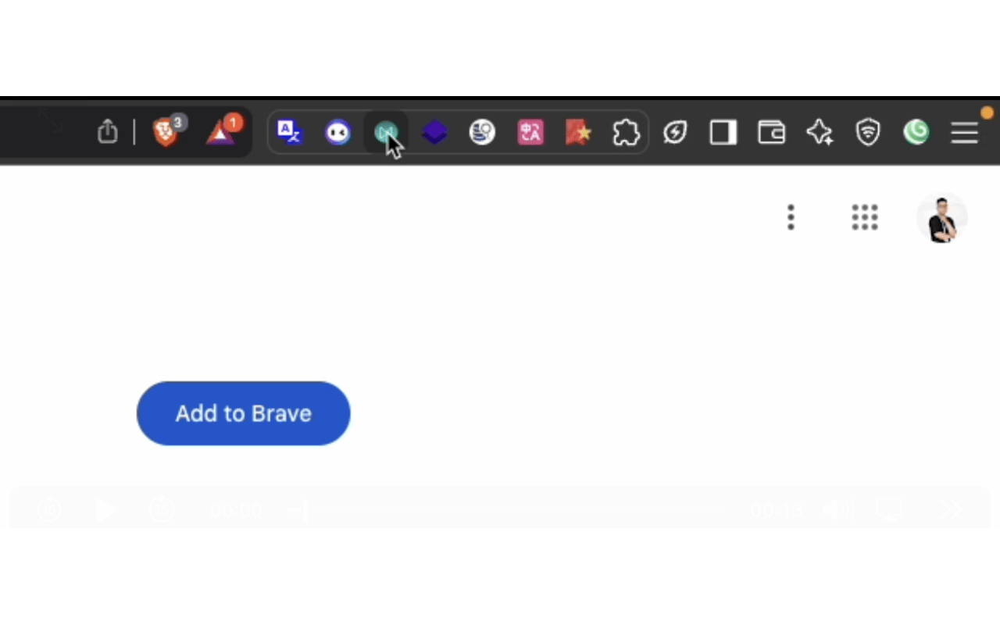
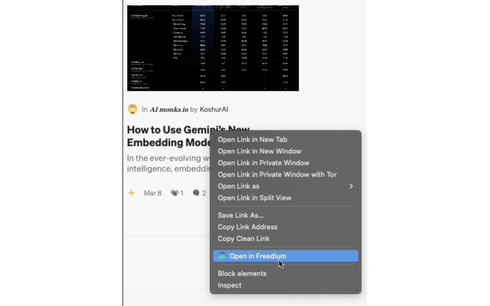

# Freedium Link Converter

[](https://chromewebstore.google.com/detail/freedium-link-converter/enocadmdedhoajldcnlajbjaihpkccml)
[](LICENSE)

> Convert Medium articles to Freedium for an ad-free reading experience

## Overview

Freedium Link Converter is a Chrome extension that automatically detects Medium articles and opens them in Freedium (freedium.cfd), providing an ad-free, paywall-free reading experience.

## ✨ Features

- 🔍 **Smart Detection** - Automatically detects Medium articles across all domains (including custom publications)
- ⚡ **One-Click Access** - Instantly open Medium articles in Freedium with a single click
- 🖱️ **Context Menu** - Right-click on Medium links or pages to open in Freedium
- 🎯 **Visual Feedback** - Badge indicators show loading, success, and error states
- 🔔 **Notifications** - Get notified when actions succeed or fail
- ⚙️ **Customizable** - Configure behavior through the options page
- 🚀 **Fast & Lightweight** - Minimal memory footprint with intelligent caching

## 📦 Installation

### For Users (Recommended)

Install directly from the Chrome Web Store:

👉 **[Install Freedium Link Converter](https://chromewebstore.google.com/detail/freedium-link-converter/enocadmdedhoajldcnlajbjaihpkccml)**

### For Developers

1. **Clone the repository**

   ```bash
   git clone https://github.com/banhmysuawx/freedium-link-converter-extensions.git
   cd freedium-link-converter-extensions
   ```

2. **Load the extension in Chrome**

   - Open Chrome and navigate to `chrome://extensions/`
   - Enable **Developer mode** (toggle in the top right corner)
   - Click **Load unpacked**
   - Select the cloned repository directory

3. **That's it!** The extension is now installed and ready to use.

### Building for Production (Optional)

To create a production build:

```bash
# Create build directory
mkdir extension-build

# Copy necessary files
cp manifest.json extension-build/
cp background.js extension-build/
cp detectMedium.js extension-build/
cp utils.js extension-build/
cp -r images/ extension-build/images/
cp -r options/ extension-build/options/

# Create zip file
cd extension-build
zip -r ../freedium-extension.zip .
cd ..

# Clean up
rm -rf extension-build
```

## 🚀 Usage

### Method 1: Toolbar Icon (Quick Access)

1. Navigate to any Medium article
2. Click the **Freedium Link Converter** icon in your browser toolbar
3. The article will automatically open in Freedium



**Visual Feedback:**

- ⏳ **Loading (...)** - Detection in progress
- ✅ **Success (✓)** - Article opened successfully
- ❌ **Error (✗)** - Not a Medium article or error occurred

### Method 2: Context Menu (Right-Click)

#### Open Current Page

1. Navigate to a Medium article
2. Right-click anywhere on the page
3. Select **"Open in Freedium"**
4. The page opens in Freedium (new or current tab based on settings)

#### Open Medium Links

1. Find any Medium article link on any webpage
2. Right-click on the link
3. Select **"Open link in Freedium"**
4. The link opens in Freedium



### Configuration Options

Access the extension settings by:

- Right-click the extension icon → **Options**
- Or go to `chrome://extensions/` → Freedium Link Converter → **Details** → **Extension options**

**Available Settings:**

- **Open in new tab** - Open Freedium articles in a new tab instead of the current tab
- **Open links on button click** - Enable/disable automatic opening when clicking the toolbar icon

## 🔍 Supported Medium Sites

The extension automatically detects Medium articles on:

- medium.com (and all subdomains)
- towardsdatascience.com
- betterprogramming.pub
- betterhumans.pub
- uxdesign.cc
- levelup.gitconnected.com
- entrepreneurshandbook.co
- python.plainenglish.io
- **Custom Medium publications** (automatically detected via metadata analysis)

## 🛠️ How It Works

1. **Domain Detection** - Instantly recognizes known Medium domains
2. **Metadata Analysis** - Analyzes page metadata for Medium-specific signals (mobile app IDs, structured data, etc.)
3. **Smart Caching** - Remembers detection results for 10 minutes to improve performance
4. **URL Conversion** - Converts Medium URLs to Freedium format: `https://freedium.cfd/[original-url]`

## 🔒 Privacy & Permissions

This extension requires the following permissions:

- **`tabs`** - To open articles in new/current tabs
- **`activeTab`** - To detect Medium articles on the current page
- **`storage`** - To save your preferences
- **`contextMenus`** - To add right-click menu options
- **`notifications`** - To show success/error notifications
- **`host_permissions`** - To fetch page metadata for Medium detection

**Privacy Note:** This extension:

- ✅ Does NOT collect any personal data
- ✅ Does NOT track your browsing history
- ✅ Only fetches page HEAD metadata (not full content)
- ✅ All processing happens locally in your browser
- ✅ No data is sent to external servers

## 🐛 Troubleshooting

### Extension icon not showing loading state

- Reload the extension from `chrome://extensions/`

### "Not a Medium Article" notification

- The page may not be a Medium article
- Try refreshing the page and clicking again
- Some custom Medium publications may not be detected

### Extension not working after update

- Reload the extension from `chrome://extensions/`
- Clear browser cache and try again

## 📝 Changelog

### v0.1.0 (Latest)

- ✨ Complete refactoring with improved architecture
- ⚡ 50% faster detection (3s timeout vs 6s)
- 💾 75% less data usage (16KB vs 64KB)
- 🔒 Enhanced security with specific domain permissions
- 🎨 Added visual feedback (badges & notifications)
- ♿ Improved accessibility
- 🐛 Fixed DOMParser compatibility in service worker

### v0.0.4

- Initial public release

## 🤝 Contributing

Contributions are welcome! Please feel free to submit a Pull Request.

1. Fork the repository
2. Create your feature branch (`git checkout -b feature/AmazingFeature`)
3. Commit your changes (`git commit -m 'Add some AmazingFeature'`)
4. Push to the branch (`git push origin feature/AmazingFeature`)
5. Open a Pull Request

## 📄 License

MIT License
